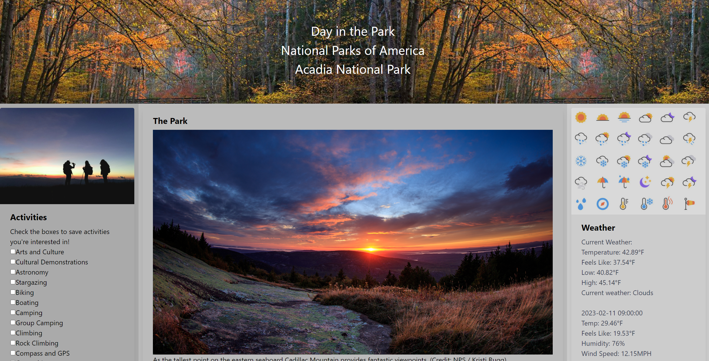

# **Day-in-the-Park**
 

## Description

motivation
- wanted to create a one-stop app for avid hikers & ameteur explorers alike who want to venture out into our nation's parks
why did we build it
- while there are apps that provide infomaiton about the national parks, we wanted to create a place where the user could get all relevant info about park, weather, activities in one place, without having to click on various URLs. this allows the user to plan their day in the park from one location. 
what problem is solved
- our app combines activities for each park along with all relevant informaoitn, such as hours/fees/contact info/etc, and weather in one convenient place. we provide URLs to the park themselves while making it easy for user to have all necessary info about th epark on our page. the app also saves user's activity choices for all parks, spitting out relevant info for any park the user chooses. 
what did we learn
- Throughout the process, we honed in on what data truly is relevant to our users. It took a few tries to make sure that the data displayed is helpful and that the user is not overloaded with information when looking at our website, making them more likely to utilize the app. 
what makes it stand out
- the built-in weather feture and the webpage's ability to remember user input for activities makes browsing the parks and planning your day in the park a breeze.

## Table of Contents
N/A

## Installation

## Usage 

 
 

 

## Credits
- Jacob Mulcahy
    - [GitHub](https://github.com/jmulcahy92)
- Jack Kelly
    - [GitHub](https://github.com/Carnificis)
- Irina Golovanich
    - [Github](https://github.com/irkag22)
 

## License
Public. 

## Badges
N/A

## Features
A Day in the Park is:
- Mobile-Friendly
- Designed with responsive UI
  

[GitHub](https://github.com/jmulcahy92/Day-in-the-Park)
 

[LiveLink](https://jmulcahy92.github.io/Day-in-the-Park/)

